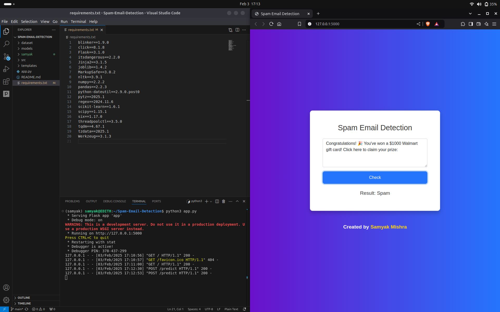

# 🚨 Spam Email Detection 🚨





## 📝 Overview
This project is a **Spam Email Detection** web application built with a **Flask backend**. It uses a **Naive Bayes classifier** for machine learning-based spam detection. The app allows users to input a message, and the model will predict whether it’s spam or not.

---

## 🔧 Technologies Used

- **Backend**: Flask (Python)
- **Frontend**:HTML, CSS
- **Machine Learning**: Scikit-learn (Naive Bayes classifier)

---

## 🌟 Features

- **Spam Detection**: Detects whether an email/message is spam or not.
- **User-Friendly Interface**: Enter a message, click **Check**, and receive instant predictions.
- **Responsive Web Design**: Designed to work seamlessly on desktops and mobile devices.
  
---

## 🖥️ Setup Instructions

### 1️⃣ Clone the Repository
Clone the repository to your local machine:

```bash
git clone https://github.com/SamyakMishra072/Spam-Email-Detection.git
cd Spam-Email-Detection
python3 
